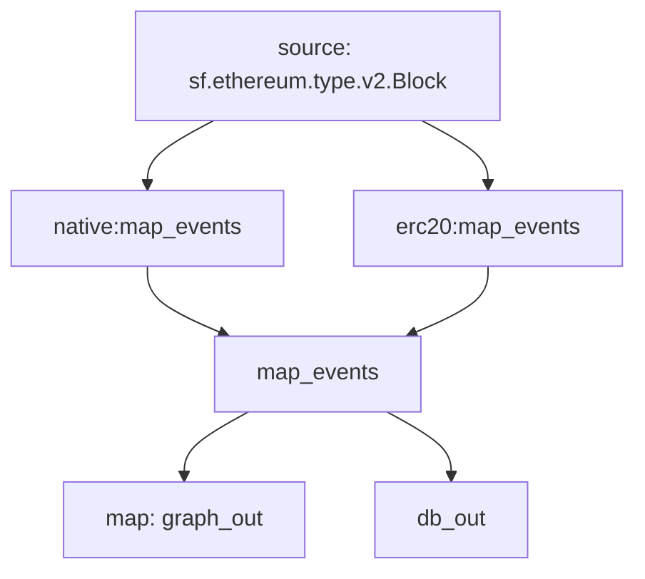

# EVM-Tokens: `Substreams`

Substreams for tracking ERC-20 & Native token balances & transfers for EVM blockchains.

> Ethereum, Base, BSC, Polygon, ArbitrumOne, Optimism, etc..

Includes the following:

- [x] Apache Parquet - File Sink (Protobuf Map modules)
- [x] Clickhouse SQL Sink
- [ ] Postgres SQL Sink
- [ ] Graph Node - Subgraphs (SpS)

## Substreams Packages

- [x] ERC-20 Balances & Transfers
- [x] Native Balances
- [x] Native Transfers
- [ ] ERC-20 Contract Metadata
- [ ] ERC-20 Supply

## Substreams Graph

