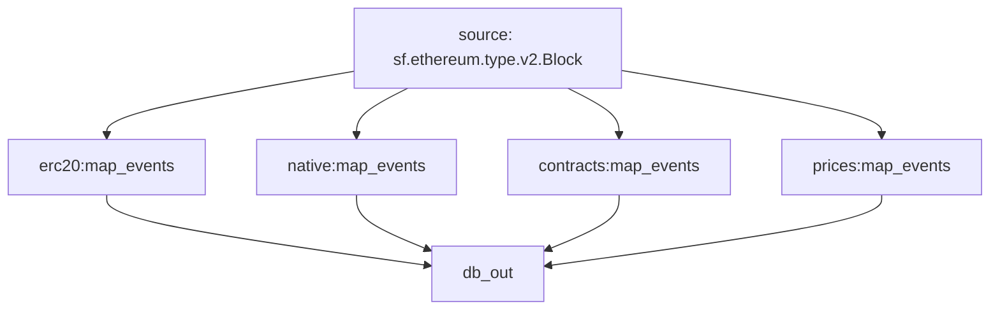

# EVM-Tokens: `Substreams`

Substreams for tracking `ERC-20` & `Native` tokens for EVM blockchains.

> Ethereum, Base, BSC, Polygon, ArbitrumOne, Optimism, etc..

## Supported by Sinks

- [x] [Substreams: File Sink](https://github.com/streamingfast/substreams-sink-files) - Apache Parquet (Protobuf Map modules)
- [x] [Substreams: SQL Sink](https://github.com/streamingfast/substreams-sink-sql) - Clickhouse / ~~PostgreSQL~~

## Substreams Packages

- [x] ERC-20 Balances & Transfers
- [x] Native Balances & Transfers
- [x] ERC-20 Contract Metadata
- [ ] EVM Token Prices
  - [ ] Uniswap V2 factories
- [ ] ERC-20 Supply

## Substreams Graph

